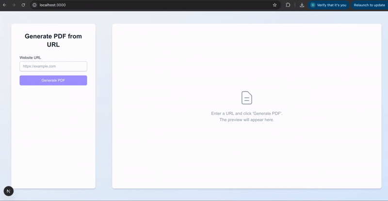

# Next.js PDF Generation Service

This project is a Next.js application designed to generate PDF documents from public webpage URLs using Puppeteer connected to a Browserless.io instance. It features a simple web interface for user interaction, efficient streaming, and a caching mechanism.


## Demo



## Core Features

*   **API Endpoint:** Provides a `/api/generate-pdf` endpoint to handle PDF generation requests.
*   **Input Validation:** Strictly validates incoming JSON payloads to ensure only a valid `url` property is present.
*   **Puppeteer/Browserless Integration:** Connects to a Browserless.io instance to leverage a remote Chrome browser for rendering.
*   **Robust Image Loading:** Implements a network interception strategy to wait for image requests to complete before generating the PDF.
*   **Efficient Streaming:** Streams the generated PDF directly to the client and cache simultaneously, minimizing server memory usage.
*   **Caching:** Uses a hybrid Redis (keys/TTL) + Filesystem (blobs) cache to store generated PDFs and serve subsequent requests quickly.
*   **Web Interface:** A clean, responsive UI built with Next.js and Tailwind CSS allowing users to input a URL, view generation progress, preview the PDF, and download the result.

## Technology Stack

*   **Framework:** Next.js (App Router)
*   **Language:** TypeScript
*   **Runtime:** Node.js
*   **Styling:** Tailwind CSS
*   **PDF Generation:** Puppeteer
*   **Headless Browser Service:** Browserless.io
*   **Caching:** Redis (for keys/metadata), Node.js Filesystem (for PDF blobs)
*   **API Client:** Fetch API

## Getting Started

### Prerequisites

*   Node.js (v18 or later recommended)
*   npm, yarn, or pnpm
*   Access to a Redis instance (local or remote)
*   A Browserless.io API Token

### Setup

1.  **Clone the repository:**
    ```bash
    git clone https://github.com/kamalkalwa/browserless-io.git
    cd browserlessio
    ```

2.  **Install dependencies:**
    ```bash
    npm install
    # or
    yarn install
    # or
    pnpm install
    ```

3.  **Configure Environment Variables:**
    Create a `.env.local` file in the project root and add the following variables:
    ```dotenv
    # .env.local
    BROWSERLESS_TOKEN=YOUR_BROWSERLESS_API_TOKEN
    REDIS_URL=redis://localhost:6379 # Or your remote Redis URL (e.g., redis://:password@hostname:port)

    # Optional: Adjust cache TTL (default is 1 hour)
    # CACHE_TTL_SECONDS=3600
    ```
    Replace `YOUR_BROWSERLESS_API_TOKEN` with your actual token. Adjust `REDIS_URL` if your Redis instance is not running locally on the default port.

4.  **Start Redis Server (if running locally):**
    Ensure your Redis server (referenced in `REDIS_URL`) is running. If you installed Redis using Homebrew, you can start it as a service:
    ```bash
    brew services start redis
    ```
    If using another method (e.g., Docker, native install), ensure it's started using the appropriate command.

5.  **Run the development server:**
    ```bash
    npm run dev
    # or
    yarn dev
    # or
    pnpm dev
    ```

6.  **Open the application:**
    Navigate to [http://localhost:3000](http://localhost:3000) in your browser.

## Architecture Overview (HLD)

The application follows a standard Next.js architecture:

1.  **Frontend (`src/app/page.tsx`, `src/components/*`):** Handles user interaction, manages UI state, and communicates with the backend API via `PdfApiClient`.
2.  **Backend API Route (`src/app/api/generate-pdf/route.ts`):** Orchestrates the PDF generation process. It receives requests, validates input, interacts with services, and streams the response.
3.  **Services (`src/services/*`):** Encapsulate specific functionalities:
    *   `BrowserlessPdfGenerator`: Handles all Puppeteer logic, connection to Browserless.io, page rendering, and PDF stream creation.
    *   `RedisFsCacheProvider`: Manages the hybrid caching logic using Redis and the local filesystem.
    *   `PdfApiClient`: Provides a clean interface for the frontend to interact with the backend API.
4.  **Interfaces (`src/interfaces/*`):** Define contracts for services (`IPdfGenerator`, `ICacheProvider`, `IApiClient`) to promote modularity and testability.
5.  **External Services:**
    *   **Browserless.io:** Provides the remote Chrome instance.
    *   **Redis:** Stores cache keys and expiration times.
    *   **Filesystem:** Stores cached PDF file blobs.

**Data Flow:**
User Input -> Frontend Component -> API Client -> Next.js API Route -> Input Validation -> Cache Check -> (Cache Miss) -> PDF Generator Service -> Browserless.io -> PDF Stream -> Cache Provider Service -> Redis / Filesystem -> Response Stream -> Frontend -> PDF Preview/Download.

## Key Design Decisions & Trade-offs

*   **API Design:**
    *   **Decision:** Strict POST request with a JSON body containing only the `url` key. Clear 400 errors for invalid payloads, 500 for server errors.
    *   **Rationale:** Enforces a clear contract, prevents unexpected input, aligns with REST principles for creating a resource (even if transient).
    *   **Trade-off:** Less flexible than allowing optional parameters (e.g., PDF format, margins) but simpler and meets core requirements.

*   **Puppeteer/Browserless Usage:**
    *   **Decision:** Connect to external Browserless.io service. Manage browser lifecycle carefully via a returned `cleanup` function. Set viewport, user agent, and emulate screen media type for desktop rendering. Use `A3` format based on testing for better layout compatibility.
    *   **Rationale:** Offloads Chrome management, leverages Browserless features. Ensures resources are freed correctly. Aims for consistent desktop PDF output.
    *   **Trade-off:** Dependency on an external service and its associated costs/limits vs. the complexity of managing local Chrome instances reliably.

*   **Image Loading Strategy:**
    *   **Decision:** Use Puppeteer's network request interception (`page.setRequestInterception`) to track image requests and wait until they are settled (finished or failed) before proceeding. Includes a timeout (`NETWORK_IDLE_TIMEOUT`).
    *   **Rationale:** More robust and reliable than DOM-based checks (`img.complete`, load events within `evaluate`) which proved brittle on complex pages. Directly addresses the requirement to avoid relying solely on `networkidle` options in `goto`.
    *   **Trade-off:** Slightly more complex implementation than DOM checks but significantly higher success rate. The timeout still makes it "best effort" if requests hang indefinitely, prioritizing service availability over potentially infinite waits.

*   **Efficient Streaming:**
    *   **Decision:** Use `page.createPDFStream()` and pipe the resulting stream simultaneously to the client response (`NextResponse`) and the cache file writer (`RedisFsCacheProvider`) using `PassThrough` streams.
    *   **Rationale:** Avoids loading the entire PDF into server memory, crucial for handling potentially large files efficiently and preventing server crashes.
    *   **Trade-off:** Requires careful stream management (handling errors, ensuring cleanup happens *after* all pipes finish) compared to simpler buffer-based approaches (`page.pdf()`).

*   **Caching Strategy:**
    *   **Decision:** Hybrid approach using Redis for keys/TTLs and the local filesystem for PDF blobs.
    *   **Rationale:** Leverages Redis's speed for cache lookups and TTL management while avoiding storing large binary blobs in Redis memory. Filesystem storage is simple for blob data.
    *   **Trade-off:** Effective for single-node deployments. Requires a shared storage solution (like S3) instead of the local filesystem if scaling horizontally across multiple server instances. No automatic cleanup of expired files from the filesystem is implemented (Redis keys expire).

*   **UI/UX (Frontend):**
    *   **Decision:** Two-column layout (input left, preview right) using Tailwind CSS. Clear state management (`isLoading`, `error`, `pdfBlobUrl`). Simulated stage-based progress indicator. Embedded PDF preview using `<iframe>`. Micro-animations for state transitions.
    *   **Rationale:** Provides a clean separation of concerns, offers immediate visual feedback (preview), and enhances user experience with progress indication and smooth transitions.
    *   **Trade-off:** Simulated progress is less accurate than real-time updates (which would require WebSockets/SSE). `<iframe>` preview is simple but offers less control than a library like `react-pdf`.

## Error Handling

*   **Backend:** `try...catch...finally` blocks ensure resource cleanup (browser closing). Specific errors (TargetClosed, ExecutionContext) are caught where possible. Validation errors return 400, internal errors return 500. Errors are logged server-side.
*   **Frontend:** Handles API fetch errors and non-2xx responses. Displays clear error messages to the user in the preview area. Loading states prevent duplicate submissions.

## Configuration

Environment variables are used for sensitive information and key settings. Configure them in a `.env.local` file:

*   `BROWSERLESS_TOKEN`: **Required**. Your API token for Browserless.io.
*   `REDIS_URL`: **Required**. Connection URL for your Redis instance.
*   `CACHE_TTL_SECONDS`: Optional. Cache duration in seconds (defaults to 3600 = 1 hour).

## Testing Strategy (Outline)

*   **Unit Tests:** Validate input validation logic, potentially mock services to test API route flow.
*   **Integration Tests:** Test the API endpoint with mocked services (Cache, PDF Generator) or against live (but controlled) external services. Verify status codes, headers, and error responses.
*   **End-to-End Tests:** Use tools like Cypress or Playwright to simulate user interaction on the frontend, trigger PDF generation, and verify the download/preview functionality.

## Potential Future Improvements

*   **Shared Cache Storage:** Replace filesystem caching with S3 or similar for multi-node deployments.
*   **Cache Cleanup:** Implement a mechanism to remove expired PDF files from the filesystem.
*   **Enhanced PDF Options:** Allow users to specify options like margins, orientation, page ranges via the API/UI.
*   **`react-pdf` Preview:** Replace `<iframe>` with `react-pdf` for more control over the preview UI (pagination, zoom).
*   **Real-time Progress:** Implement WebSockets or Server-Sent Events for accurate backend progress updates.
*   **Rate Limiting:** Add rate limiting to the API endpoint (potentially using Redis).

## Deploy on Vercel

The easiest way to deploy your Next.js app is to use the [Vercel Platform](https://vercel.com/new?utm_medium=default-template&filter=next.js&utm_source=create-next-app&utm_campaign=create-next-app-readme) from the creators of Next.js.

Remember to configure the necessary environment variables (`BROWSERLESS_TOKEN`, `REDIS_URL`) in your Vercel project settings.

Check out the [Next.js deployment documentation](https://nextjs.org/docs/app/building-your-application/deploying) for more details.
